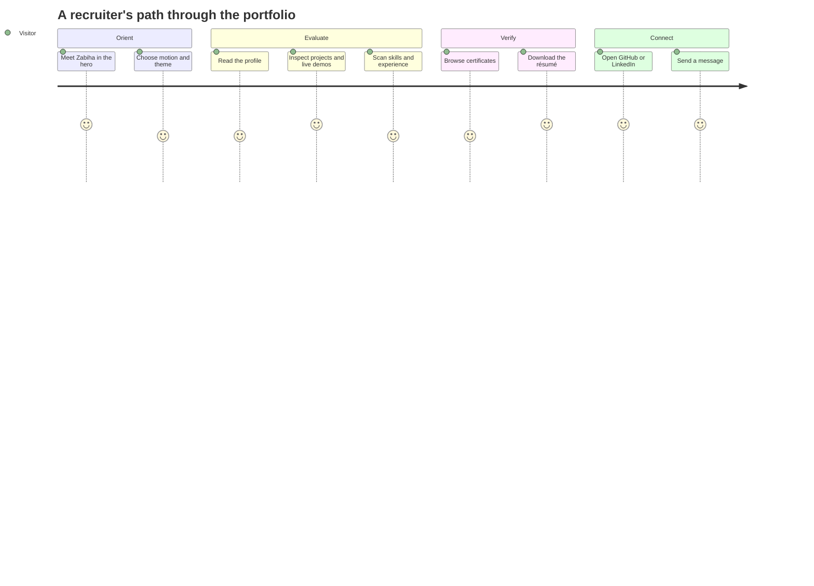
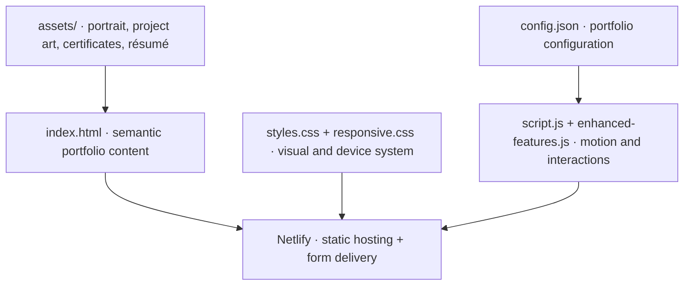

<div align="center">

```text
ZMK // AI PORTFOLIO SYSTEM
STATUS: ONLINE  •  MODE: INTERACTIVE  •  FOCUS: INTELLIGENT SYSTEMS
```

# Zabiha Muskan K — Portfolio

An immersive, single-page profile for an aspiring AI/ML engineer: projects, skills, experience, certificates, résumé, and contact paths arranged as one navigable story.

[](https://zabiha-muskan.netlify.app)
[](#system-map)
[](LICENSE)

</div>


## `profile.scan()`

| Signal | What the site surfaces |
|---|---|
| **Mission** | AI/ML engineering, intelligent agents, problem solving, and continuous learning |
| **Proof of work** | Fraud detection, finance tracking, Gemini chatbot, and JARVIS assistant projects |
| **Toolbox** | Python, Java, JavaScript, HTML/CSS, SQL, scikit-learn, XGBoost, and related tooling |
| **Credentials** | Visual certificate gallery and downloadable résumé |
| **Connection** | GitHub, LinkedIn, email, and a contact form |

The live experience includes a motion preference prompt, light/dark modes, animated hero treatment, numbered story sections, counters, project cards, certificate imagery, and responsive navigation.

## Visitor telemetry



## Project constellation

- **Fraud Detection in Financial Transactions** — a machine-learning Streamlit experience for classifying transaction risk.
- **Finance Tracker** — a Python/Pandas workflow for recording and visualizing personal finance data.
- **Gemini Chatbot** — a real-time conversational interface built around Google Gemini and Streamlit.
- **JARVIS AI Assistant** — a desktop voice and automation experiment.

Project links belong to the portfolio subject and may lead to external repositories or deployments maintained separately from this codebase.

## System map



Despite older documentation mentioning React, Node, MongoDB, Gemini integration, and Vercel/Render, the checked-in deployable project is a static HTML/CSS/JavaScript portfolio with Netlify configuration. This README documents the repository as it exists now.

## Boot sequence

No dependency install or framework build is required.

```bash
git clone https://github.com/QizarBilal/Client-Portfolio.git
cd Client-Portfolio
python -m http.server 8080
```

Open `http://localhost:8080`. Serving the files locally is preferable to opening `index.html` directly because browser security rules can affect form and asset behavior.

## Content controls

| Change | Primary location |
|---|---|
| Bio, project copy, skills, experience, and contact links | `index.html` / `config.json` |
| Color, layout, motion, light/dark treatment | `styles.css` |
| Mobile and small-screen behavior | `responsive.css` |
| Intro, counters, theme, navigation, filters, and effects | `script.js` / `enhanced-features.js` |
| Portrait, projects, certificates, résumé | `assets/` |

## Privacy and accuracy checklist

- [ ] Obtain permission before replacing the portrait, résumé, or certificates.
- [ ] Remove stale phone numbers, email addresses, and social links promptly.
- [ ] Verify every project description, demo, metric, and skill claim with the portfolio owner.
- [ ] Do not commit private application data or form submissions.
- [ ] Keep résumé PDFs free of unnecessary personal identifiers.
- [ ] Test the reduced-motion path as carefully as the animated experience.

## Visual QA protocol

Test the home hero, every numbered section, both themes, the motion opt-out, mobile navigation, project links, résumé download, and contact submission. Verify at keyboard-only, 320 px, tablet, and wide desktop widths.

## Credits & license

Portfolio identity and career content represent **Zabiha Muskan K**. Website source code is available under the [MIT License](LICENSE). Portraits, résumé data, certificates, project screenshots, institutional marks, and other personal or third-party assets remain owned by their respective rights holders and are not relicensed by MIT.

<div align="center">

`END OF README // START OF CONVERSATION`

</div>

# Zab Portfolio - Modern AI/ML Engineer Portfolio

A modern, responsive portfolio website showcasing AI/ML projects and skills.

## Features

- 🎨 Modern, futuristic design with dark/light mode
- 🤖 AI-powered chatbot using Gemini API
- 📱 Fully responsive design
- 🚀 React frontend with Tailwind CSS
- 🛠️ Node.js backend with MongoDB
- ✨ Smooth animations and transitions
- 📄 Downloadable resume
- 📧 Contact form with email notifications

## Quick Start

```bash
# Install all dependencies
npm run install-all

# Start development server
npm run dev
```

## Tech Stack

- **Frontend:** React 18, Tailwind CSS, Framer Motion
- **Backend:** Node.js, Express, MongoDB
- **AI:** Google Gemini API
- **Deployment:** Vercel (frontend), Render (backend)

## Author

**Zabiha Muskan K**  
Aspiring AI/ML Engineer | Python Developer
